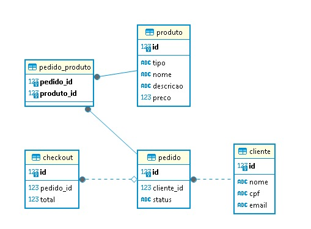

<h1 align="center">TechChallenge Fiap - Restaurante</h1>

  

## Projeto

Projeto voltado para o fluxo de um restaurante, desde a fase de pedidos até o inicio da fila com um fakecheckout, 

## Rodando projeto

faça o clone do projeto https://github.com/LucasRFigueiredo/TechChallengeFIAP.git

após fazer o clone, vá ate a pasta e execute o comando docker-compose up --build

e para fazer as requests seguir as colections

## Tecnologia

Este projeto foi desenvolvido utilizando as seguintes tecnologias e conceitos:

- [Java](https://www.java.com/pt-BR/)
- [Docker](https://www.docker.com/)
- [DDD (Domain-driven Design)](https://domainlanguage.com/)
- [Hexagonal Architecture](<https://en.wikipedia.org/wiki/Hexagonal_architecture_(software)>)

## Banco de dados (DER/Postgres)

  

## DDD (Domain-Driven Design)

  

### Dicionário Ubíquo
#### Pedido:
- status: O status atual do pedido (por exemplo, "Em preparação", "Finalizado").

#### Cliente:
- nome: O nome do cliente.
- cpf: O número de CPF do cliente.
- email: O endereço de e-mail do cliente.

#### Produto:
- tipo: O tipo de produto (por exemplo, "Alimento", "Bebida", "Sobremesa").
- nome: O nome do produto.
- descricao: Uma descrição do produto.
- preço: O preço do produto.

#### Checkout
- total: Valor total do pedido

### Event Storming
https://miro.com/app/board/uXjVNWGRxow=/

  

### Melhor exibição

  

  

  

## 📝 License

This project is licensed under the MIT License. For more information, please refer to the [LICENSE](LICENSE.md) file.
